# Feedback about the review
Thanks for your review, Sorry because let the codebase as the stage I deployed fully serverless for both Backend and Frontend, I've updated codebase for you can run on local.
But I can not reproduce the issue you stucked (invalid_token)

## invalid_token issue
I've tested the URL http://thienphuoc1990-serverless-fs-todo-app-static-site-dev.s3-website-us-east-1.amazonaws.com/
And it still worked fine on my side in normal browser and incognito.
You can see images below:

Normal browser: 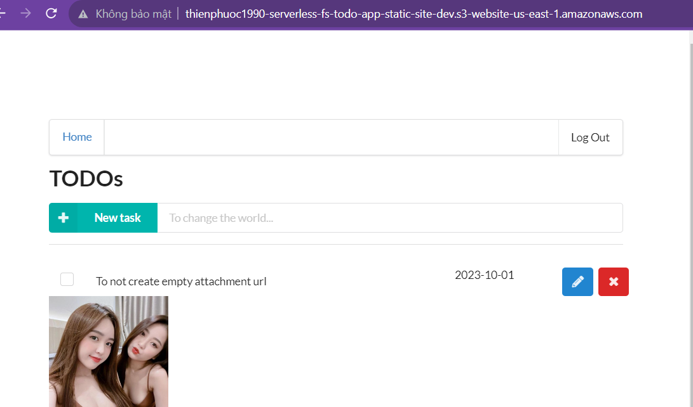
Incognito: 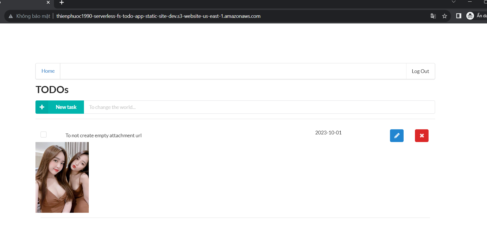
Firefox with new account: 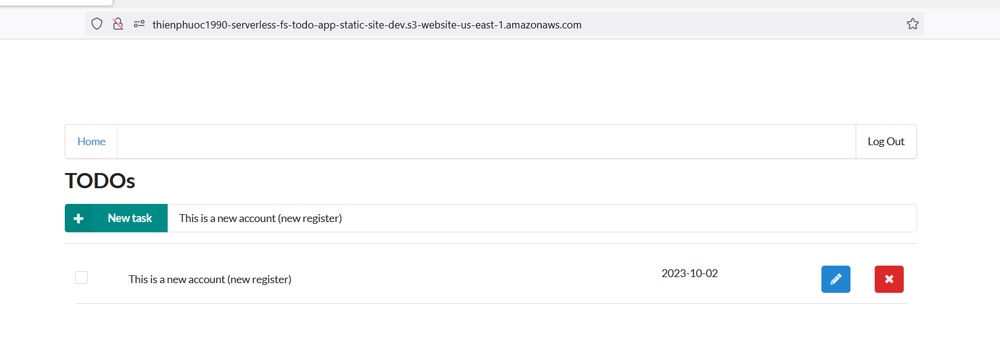

Beside that the Auth0 configs were correctly:

Auth0 domain: 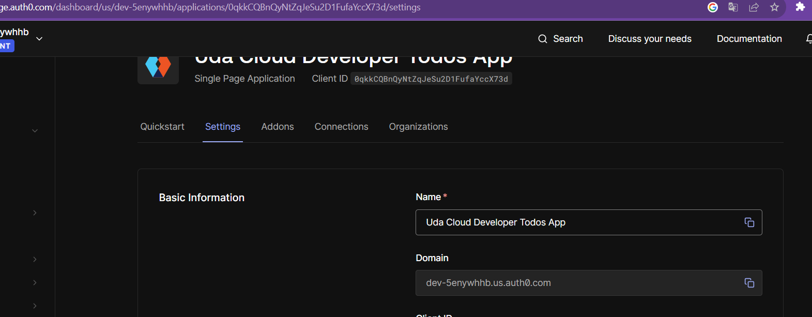
Auth0 CORS: 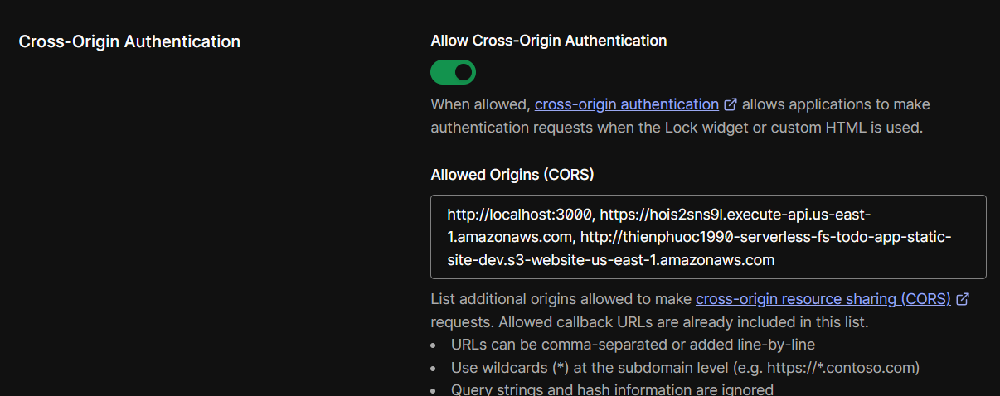
Auth0 Allowed callback url: 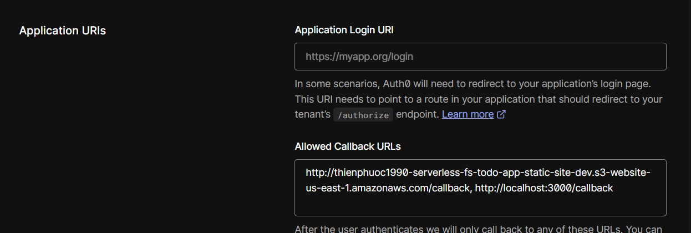
Auth0 Client Id: 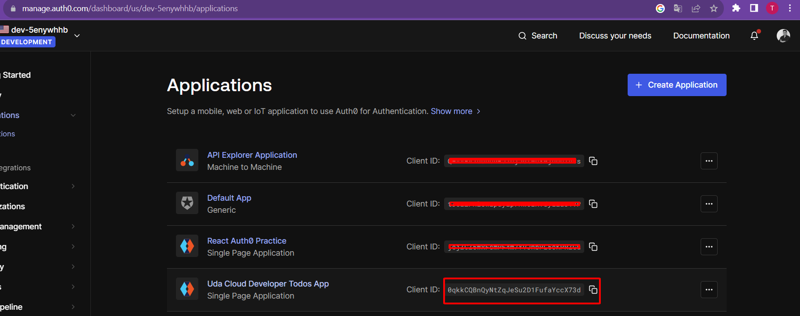
Auth0 Domain: 
This match with your screenshot in your review:  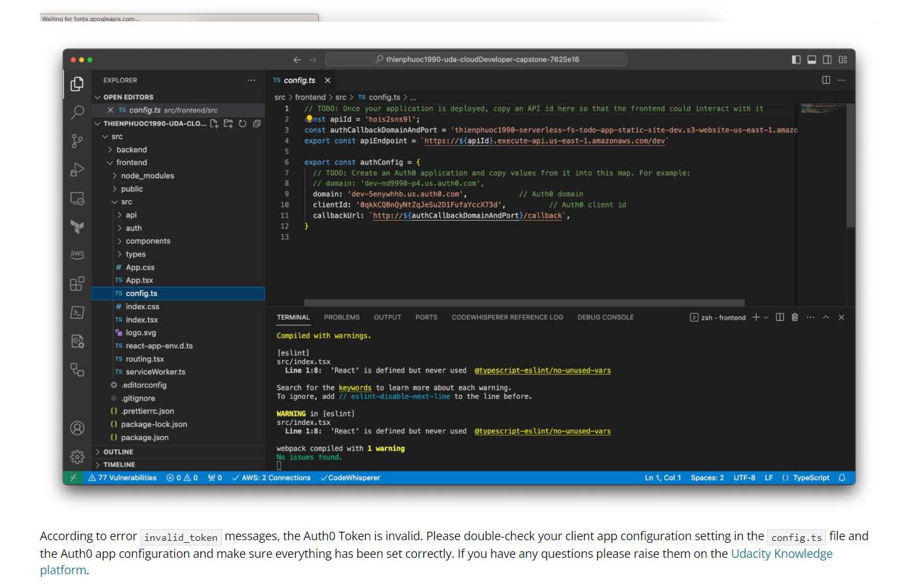

So could you test it again? Beside that, that URL is S3 Static Site. And my code is to deploy on S3 Static Site, no need to run on local. But in the second submit I will update code for it ready to run on local.

Note: After all I can reproduce your invalid_token, the root cause is I reuse the project 4, and update it to fully serverless, I mean the frontend will be deployed by command "serverless deploy" like backend and it will run as the S3 Static Site.
And the codebase I push to repo is this state, and you run it up on local, as this time, the Auth0 callback domain is S3 Static Site, but it was run on local with domain localhost and port 3000. So when it authenticated in Auth0 and the callback call to S3 Static Site, they are 2 difference domains (wrong origin), so it created the issue.

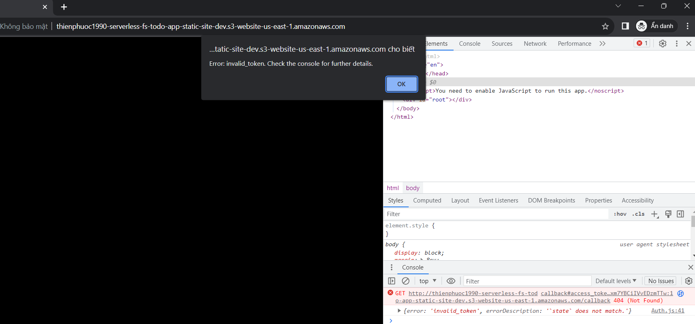

## Run on local
As I deployed the app to S3 Static Site by command "serverless deploy" so it is the part of serverless, and no need to run up the code on local. But for review purpose I updated the code to run local.
Here is some images demo project frontend work on local:

Local: 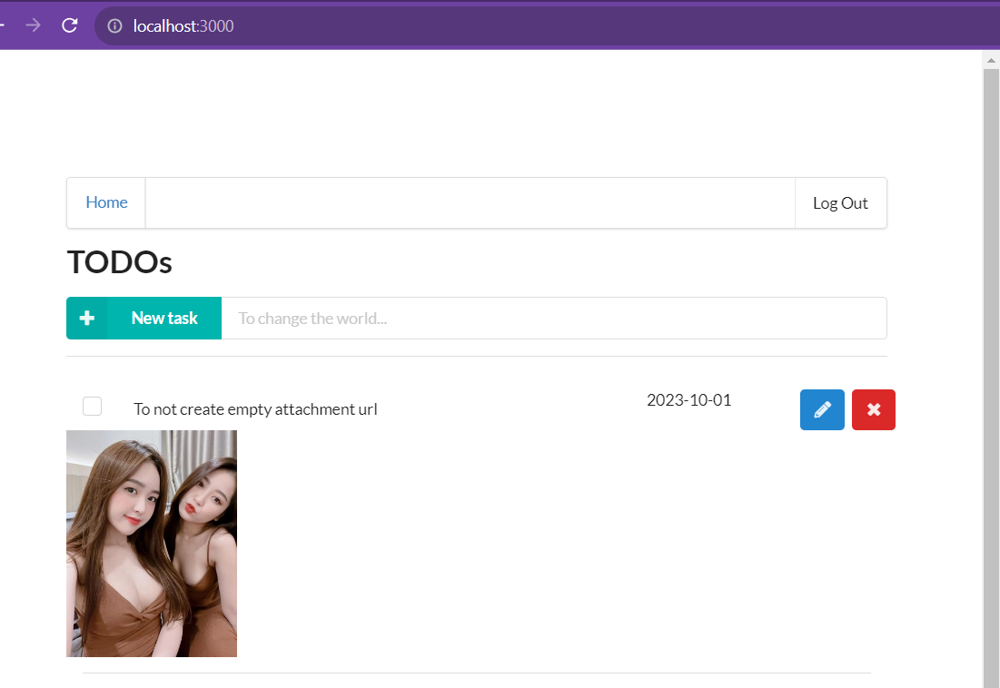
Local incognito new account: 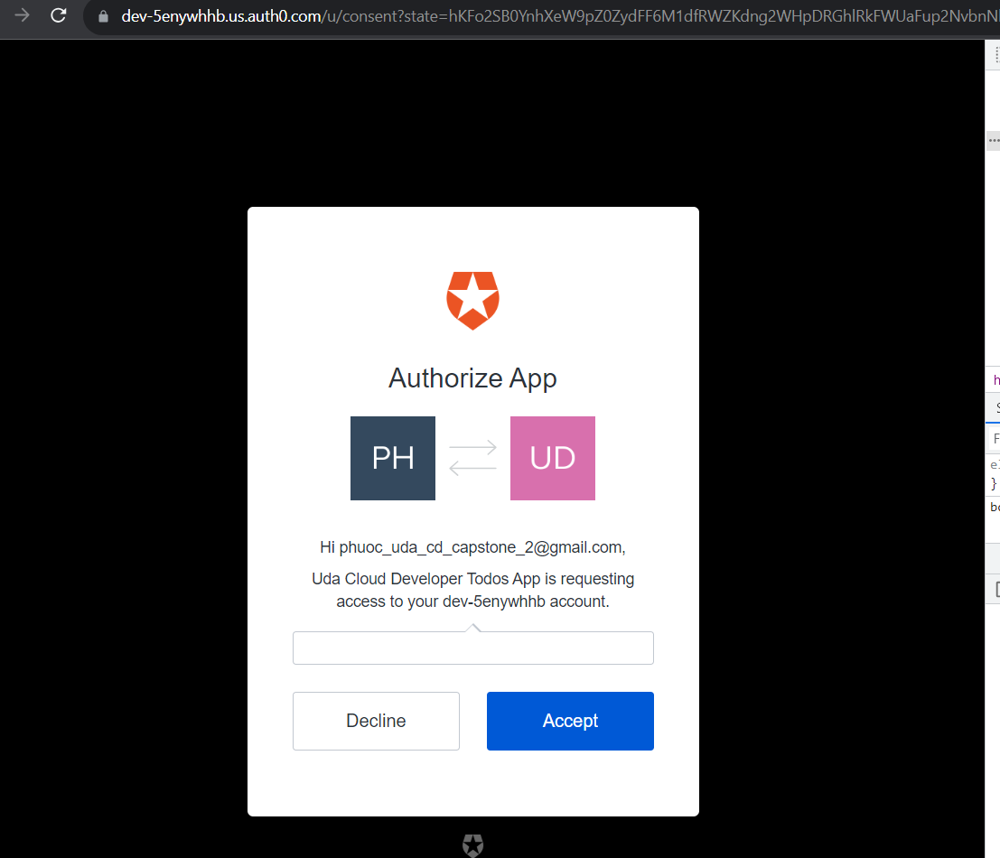
Local incognito new account working: 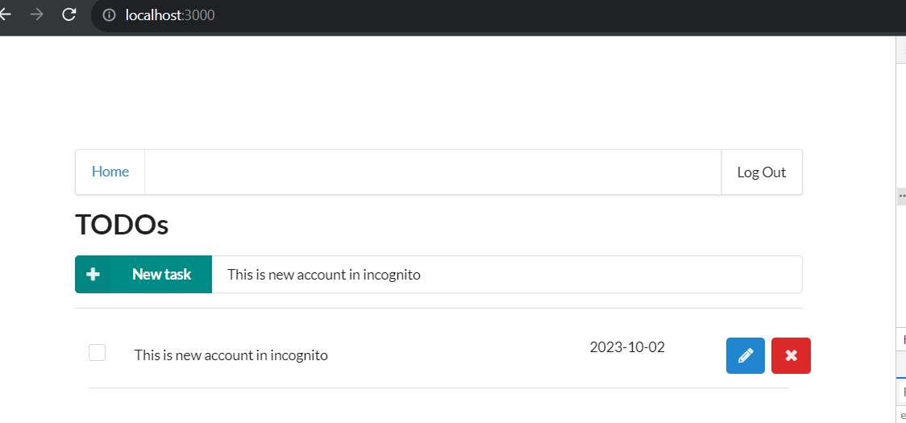

## you should add extra features and abilities to the Serverless project as your Capstone project.
Thanks for your remind, let's me explain my idea.
So on the serverless project we created the project includes frontend and backend, the backend use lambda functions and work as serverless app. But the frontend only for testing purpose and must run up by local.

So my idea is make the whole app to be serverless. So I update the frontend and serverless to build and deploy the Frontend to S3 and set it as S3 Static Site. Then we can deploy both Frontend and Backend with command "serverless deploy" and both of them are serverless. The Frontend always available until we destroy it.

Beside that, I update the way that the image will be render and the data flow when create todo item. In the serverless project (project 4) when create todo item it will create the todo item with the attachment url - as this time, that link will load nothing, because the image still not be uploaded.
And I update to create todo item will not create with attachment url, and when upload attachment, it will update the todo item with attachment URL. So it will never render unable to load image when just created the todo item.
And I improve a little when create todo item, it will auto redirect to home (todos list page)

And I added unit tests and integration tests, not fully 100% percent coverage, but I think they are enough as I provided the tests.